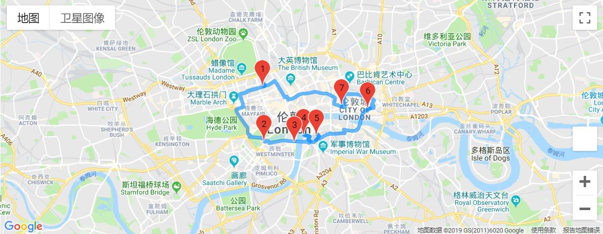

# TSP-Tour-Route

Solving the Traveling Salesman Problem using google OR-Tools.

## Feature

* Let you visit all the attractions you plan to go in the fastest way.

* Four modes to choose including walking, driving, bicycling and transit.

* Good visualization powered by gmaps, provide two different maps.

## Introduction of Travelling salesman problem

"The **travelling salesman problem** (**TSP**) asks the following question: "Given a list of cities and the distances between each pair of cities, what is the shortest possible route that visits each city and returns to the origin city?" It is an [NP-hard](https://en.wikipedia.org/wiki/NP-hardness)problem in [combinatorial optimization](https://en.wikipedia.org/wiki/Combinatorial_optimization)." (**more details on** [**Wikipedia**](https://en.wikipedia.org/wiki/Travelling_salesman_problem))

## usage

* Make sure you have already installed these packages: googleplaces, googlemaps, gmaps, ortools.
* Get Google API key from this website: [https://developers.google.com/maps/documentation/distance-matrix/start#get-a-key](https://developers.google.com/maps/documentation/distance-matrix/start#get-a-key).
* Change the variable 'places' and 'location' then run all the cells.
* PS: If the fig is not showed after running all cells, try to restart the Jupyter notebook.

## License
MIT License
